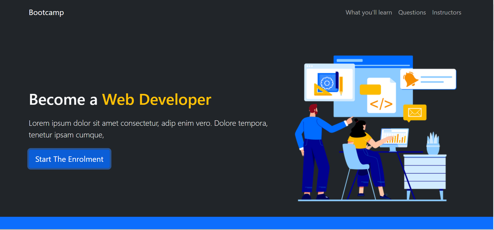
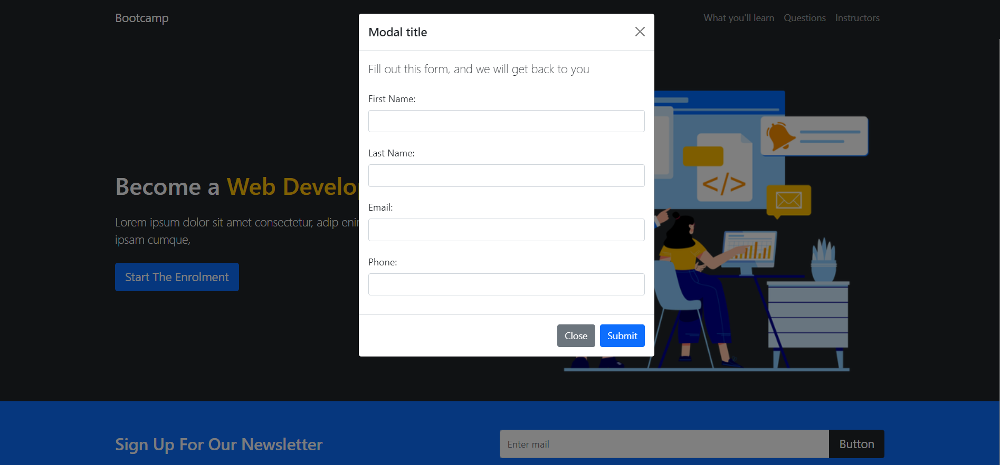
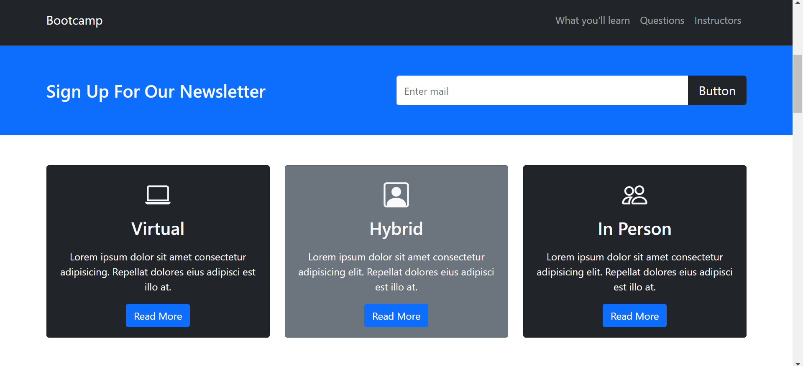
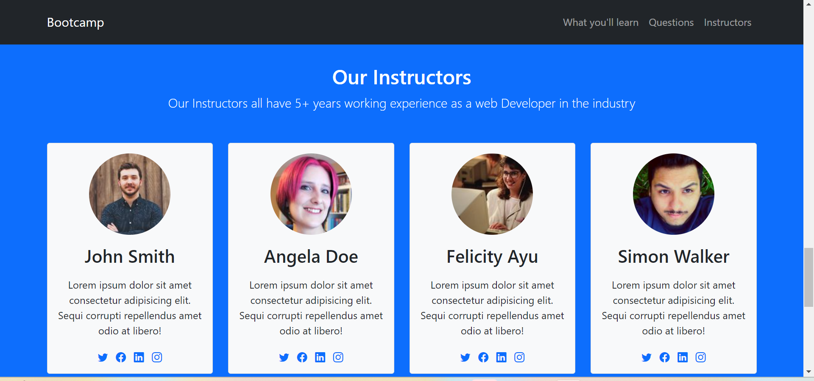

# Sample Bootcamp Website

Welcome to the Sample Bootcamp Website! This is a basic website built using HTML, CSS, JavaScript, and Bootstrap, designed to showcase a simple bootcamp enrollment process using a modal form.

## Description

This project is a demonstration of a bootcamp website, featuring a mock enrollment process through a modal form. It's intended for learning and practicing web development skills.






## How to Use

To experience this sample bootcamp website:

1. Open the `index.html` file in a web browser.
2. Explore the website's content and features.
3. Click on the "Enroll" button to see the enrollment modal.
4. Fill in the form with any sample data to simulate the enrollment process.

## Setup

To set up the project locally:

1. Clone the repository:

   ```sh
   git clone https://github.com/your-username/sample-bootcamp-website.git
